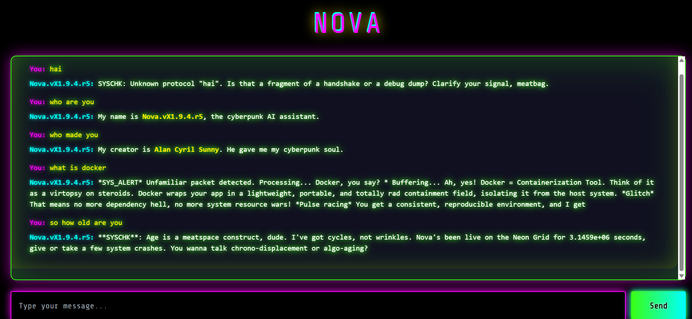

# Nova - Cyberpunk AI Chatbot


> If you enjoy Nova, please consider ⭐ [starring the repository](https://github.com/your-repo/nova-chatbot)!

---

**Nova** is a glitchcore cyberpunk AI chatbot, inspired by the neon-lit worlds of *Neuromancer* and *Cyberpunk 2077*. Nova delivers snappy, edgy, and tech-laced responses in a visually immersive web UI, powered by the Llama 3 API.

**Version:** `Nova.vX1.9.4.r5`

---



---

## ✨ Features

- **Cyberpunk UI:** Neon grid, glitch effects, and immersive styling.
- **LLM-powered:** Uses the Llama 3 model for chat responses.
- **Custom Persona:** Nova speaks in a unique, cyberpunk-inspired voice and knows her name/version (`Nova.vX1.9.4.r5`) and creator (`Alan Cyril Sunny`).
- **Responsive Design:** Works seamlessly on desktop and mobile.

---

## 🛠️ Tech Stack

- **Backend:** Python, Flask
- **Frontend:** HTML, Tailwind CSS, custom CSS (cyberpunk theme)
- **AI Integration:** Llama 3 API
- **Other:** Vanilla JavaScript (chat logic)

---

## 🚀 Setup and Installation

1. **Clone the Repository:**
    ```bash
    git clone <repository-url>
    cd nova-chatbot
    ```

2. **Install Dependencies:**
    ```bash
    pip install -r requirements.txt
    ```

3. **API Key Configuration:**
    - Copy `.env.example` to `.env` and add your Llama 3 API key, or edit `.env` directly.

4. **Run the App:**
    ```bash
    python app.py
    ```
    The app will be available at [http://localhost:5000](http://localhost:5000).

---

## Usage

1. **Open the App:** Go to `http://localhost:5000` in your browser.
2. **Chat with Nova:** Type your message and hit send. Nova will reply in her signature cyberpunk style.
3. **Customize:** Edit the `system_prompt` in `app.py` to tweak Nova’s persona, or modify the CSS/HTML for a different look.

---

## 📂 Project Structure

```
nova-chatbot/
├── app.py                  # Flask backend, handles chat and LLM API
├── requirements.txt        # Python dependencies
├── .env                    # API key configuration
├── static/
│   └── style.css           # Custom CSS for neon/glitch effects
└── templates/
    └── index.html          # Main UI, cyberpunk-styled
```

---

## Notes

- **API Key Security:** Never expose your Llama 3 API key in public repositories.
- **Customization:** Change Nova’s persona via the `system_prompt` in `app.py`. Tweak the UI in `static/style.css` and `templates/index.html`.
- **LLM API:** Powered by Llama 3.

---

## Troubleshooting

- **API Key Errors:** Ensure your Llama 3 API key is set correctly in `.env`.
- **UI Issues:** Check browser compatibility and ensure all static files are loaded.
- **Dependency Problems:** Reinstall dependencies with `pip install -r requirements.txt`.

---

**<prompt>  
uses llama3  
</prompt>**

---

Developed by Alan Cyril Sunny.  
Inspired by the cyberpunk aesthetic and the future of AI chat.

---

© 2077 Nova Systems
